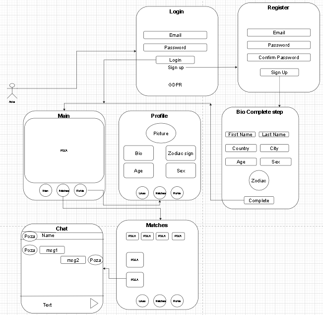
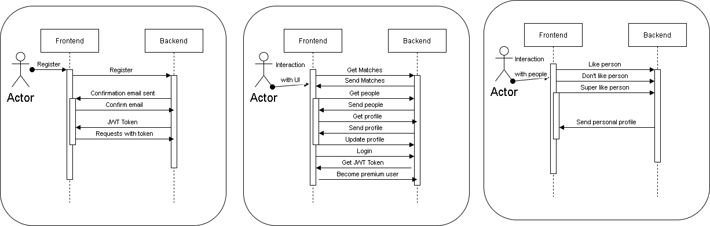
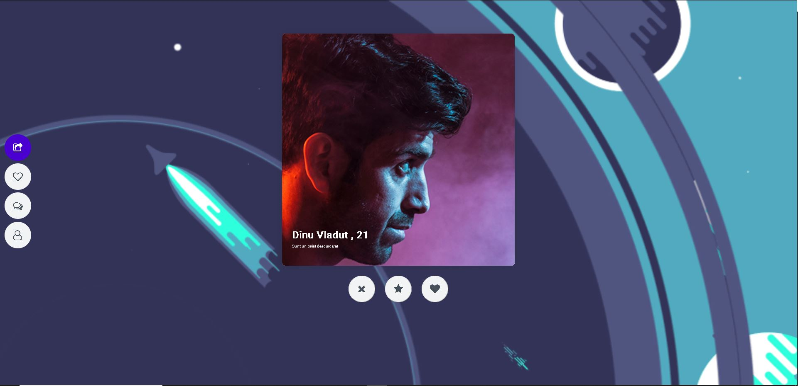
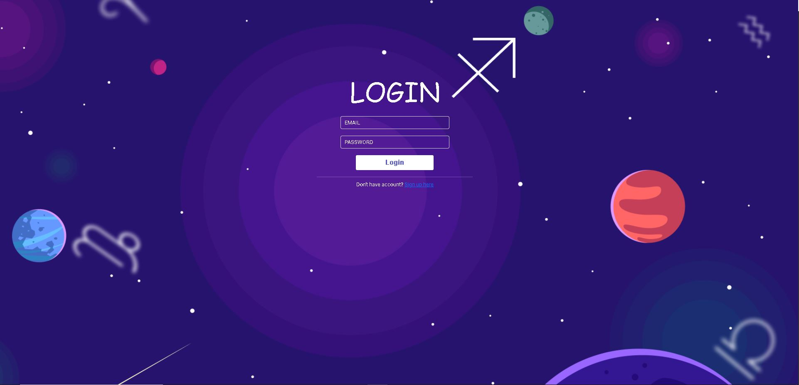
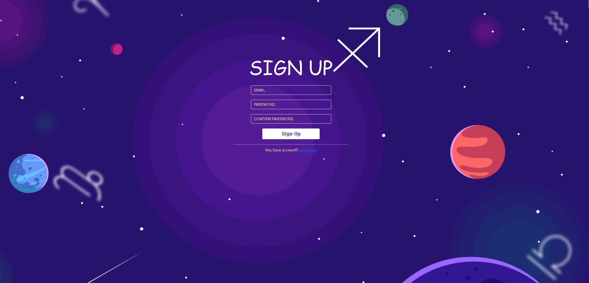
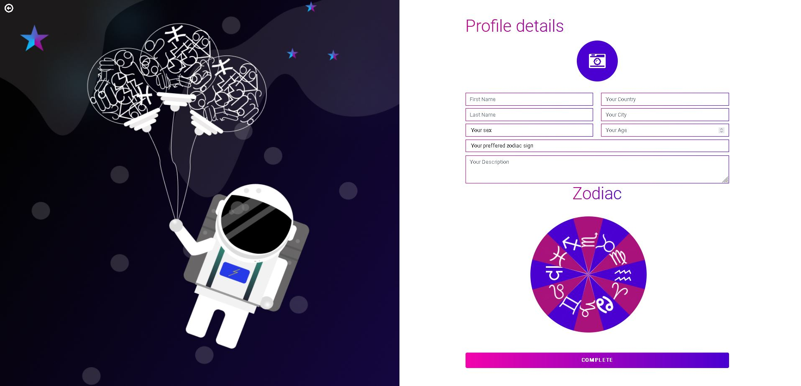
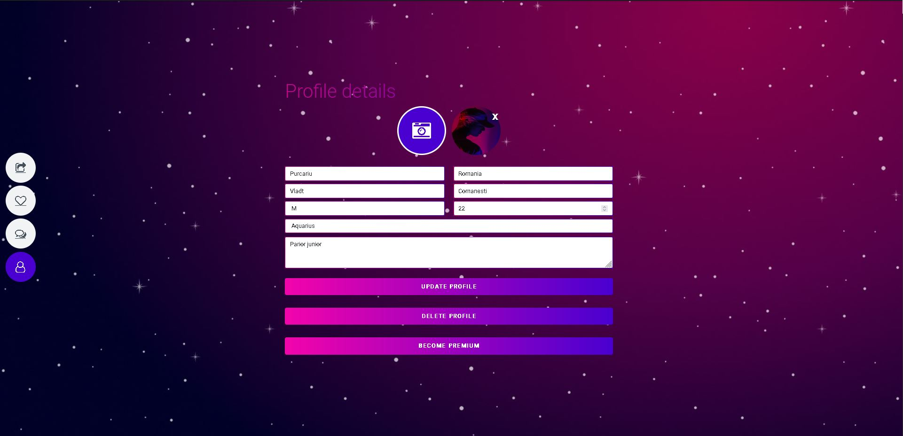
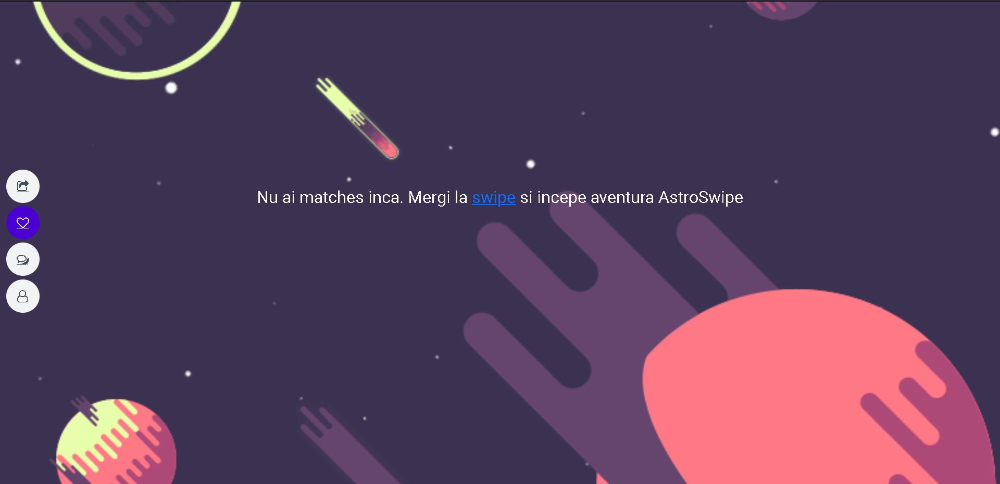
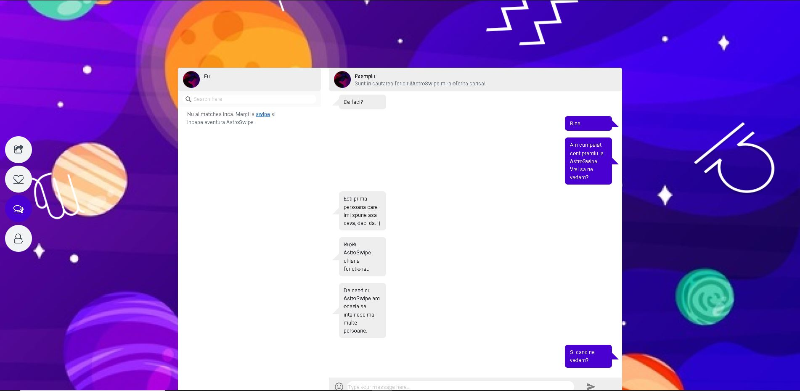

ASTROSWIPE
=====
Disciplina: ISW
----

Membrii+Roluri:
----

- Dinu Ionut Vladut:PM+DEV

- Purcariu Vladut Ionel:DEV

- Popa Lorena:Tester+Mobile DEV

- Zidaru Marian George:DOC

Tehnologii necesare
====

Docker:
----
* Se acceseaza urmatorul link : https://www.docker.com/get-started si se descarca si instaleaza "Docker".
* Se instaleaza urmatorul pachet: https://docs.microsoft.com/en-us/windows/wsl/install-manual#step-4---download-the-linux-kernel-update-package 
* Se porneste aplicatia "Docker Desktop".

Rulare aplicatie:
====
- IMPORTANT: Pentru rularea aplicatiei este nevoie sa aveti instalat Docker Desktop, respectiv componentele mentionate mai sus in sectiunea *Docker*
- IMPORTANT: Se recomanda folosirea browser-ului Firefox deoarece Chrome nu functioneaza corect.
- Se cloneaza repository-ul prin comanda `git clone https://github.com/VladutDinu/AstroSwipe.git`.
- Se intra in directorul "frontend" si se ruleaza comanda `docker build -t isw_frontend .`
- Se intra in directorul "backend" si se ruleaza comanda `docker build -t isw_backend .`
- Se intra in directorul "dev-ops" si se ruleaza comanda `docker-compose up -d`.
- Se asteapta 2 minute pentru build-ul intern a front-end-ului si apoi se acceseaza link-ul "localhost:5000".
- IMPORTANT: In cazul in care niciun serviciu din aplicatie nu functioneaza, va rugam sa ne contactati pe email-ul AstroSwipe@gmail.com, deoarece baza de date online este una free tier si intra in pauza odata la 3 zile.

Diagrame:
====

Prezentarea aplicatie
====

Main page
---

Login page
---

Sign up page
---

Profile-sign-up page
---

Profile page
---

Matches page
---

Chat page
---
